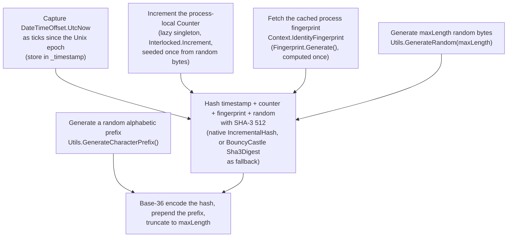
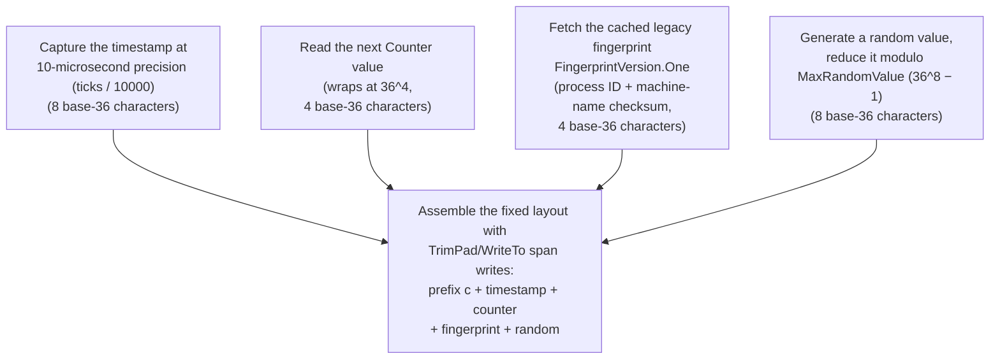

# ARCHITECTURE

This document describes the internal design of the cuid.net library.
Read it before you change `Cuid2`, `Cuid`, or any of their supporting types.

---

## Solution Layout

The library lives entirely in `src/cuid.net/`. The layout is flat by design:

```
src/cuid.net/
├── Cuid2.cs                            Recommended CUID type (CUIDv2)
├── Cuid.cs                             Deprecated CUID type (CUIDv1, VISLIB0001)
├── Fingerprint.cs                      Host-identity generation, both fingerprint versions
├── Utils.cs                            Base-36 encode/decode, random-byte generation
├── Obsoletions.cs                      Shared diagnostic ID and message for obsoleted APIs
├── Abstractions/
│   └── FingerprintVersion.cs           Enum: None, One (Cuid), Two (Cuid2)
├── Extensions/
│   └── StringExtensions.cs             Zero-allocation TrimPad/WriteTo span helpers
└── Serialization/
    └── Json/Converters/
        └── CuidConverter.cs            System.Text.Json converter for Cuid (v1 only)
```

`Cuid2` and `Cuid` do not depend on each other. Each type owns its full
pipeline: timestamp capture, counter, fingerprint, random bytes, and
assembly into a string. They share only `Fingerprint.cs` and `Utils.cs`.

---

## Type Comparison

The library ships two identifier types:

| Type    | Status                      | Description                                                                                                   |
|---------|------------------------------|------------------------------------------------------------------------------------------------------------------|
| `Cuid2` | **Recommended**              | It is cryptographically strong. Its length varies from 4 to 32 characters (default 24). It uses SHA-3 512-bit hashing. Its value is opaque. |
| `Cuid`  | **Deprecated** (`VISLIB0001`) | It is sortable and always 25 characters. It leaks the creation timestamp. The library keeps it only for backward compatibility. |

---

## Cuid2 (recommended)

`Cuid2` is an immutable `readonly struct` with `[StructLayout(LayoutKind.Sequential)]`.
It implements `IEquatable<Cuid2>`. The constructor sets every field once.
The implementation is in `src/cuid.net/Cuid2.cs`.

### Construction Pipeline

The constructor builds an identifier in six steps:



Step order in code:

1. Capture the timestamp.
2. Increment the counter.
3. Fetch the fingerprint.
4. Generate the prefix.
5. Generate the random bytes.
6. Hash the timestamp, counter, fingerprint, and random bytes. Encode the result.

The diagram groups steps by the value they feed into, not by execution order.

### Performance Details

`Cuid2` hashes through one of two paths. `ComputeValue()` selects the path
on every call:

- On `net8.0` and `net10.0`, `Cuid2` checks `SHA3_512.IsSupported`. If the OS
  and runtime provide a native SHA3-512 implementation, `ComputeValueNative()`
  uses it through `IncrementalHash`. This path reuses one `[ThreadStatic]
  IncrementalHash` instance per thread. It does not dispose the instance
  after use. The native digest context sits behind a `SafeHandle` (for
  example `SafeEvpMdCtxHandle` on Linux), which finalizes the native handle
  on its own once the thread-static reference becomes unreachable, so
  caching it for the life of the thread does not leak it.
  `TryGetHashAndReset` clears the instance's internal state after each
  hash. The next call on the same thread reuses the cleared instance.
  `stackalloc` provides the 16-byte timestamp/counter block and the
  hash-output buffer.
- The netstandard targets always use the other path. `net8.0` and `net10.0`
  also use it when the OS or runtime does not provide a native SHA3-512
  implementation. `ComputeValueFallback()` uses BouncyCastle. `Cuid2` reuses
  one `[ThreadStatic] Sha3Digest` instance per thread. It does not allocate
  a new digest on every call. On `net8.0` and `net10.0`, this path also runs
  on `Span<byte>` buffers. The netstandard targets fall back to array-based
  `BlockUpdate`/`DoFinal` overloads. They do not have `Span<T>` overloads.

`Cuid2` computes the process fingerprint once per process. It caches the
fingerprint in a nested static class, `Context.IdentityFingerprint`. Every
`Cuid2` instance reads the cached value. It does not recompute the
fingerprint.

### Equality

`Equals` checks the four scalar fields first (`_counter`, `_maxLength`,
`_prefix`, `_timestamp`). It returns `false` immediately on any mismatch. If
all scalars match, `Equals` compares the two byte arrays (`_fingerprint`,
`_random`). It uses `ReferenceEquals` as a fast path, then falls back to
`SequenceEqual`. A `default(Cuid2)` has null arrays. `Equals` treats two
default instances as equal. It treats a default instance as unequal to any
constructed instance.

`DateTimeOffset.UnixEpoch` is not available in netstandard2.0. `Cuid2.cs`
guards this API with `#if NETSTANDARD` and computes the epoch manually.

### Usage

```csharp
Cuid2 id = new();            // default length 24
Cuid2 id = new(32);          // custom length 4–32
string s  = id.ToString();
```

---

## Cuid (deprecated)

`Cuid` is a `readonly struct`. It implements `IComparable`, `IComparable<Cuid>`,
`IEquatable<Cuid>`, and `IXmlSerializable`. `CuidConverter` handles JSON
serialization. `[XmlRoot("cuid")]` handles XML serialization.
The implementation is in `src/cuid.net/Cuid.cs`.

`Cuid` carries `[Obsolete(Obsoletions.s_cuidMessage, DiagnosticId = Obsoletions.s_cuidDiagId)]`.
The compiler emits diagnostic `VISLIB0001` for every use.
Do not use `Cuid` in new code. The type exists only to support migration from
earlier versions.

### Construction Pipeline

`NewCuid()` builds a fixed 25-character value:



1. Capture the timestamp at 10-microsecond precision (`ticks / 10000`). This
   fits in 8 base-36 characters.
2. Read the next `Counter` value. This counter differs from `Cuid2`'s
   counter: it wraps to zero after `36^4` discrete values. It always fits in
   4 base-36 characters.
3. Fetch the cached legacy fingerprint (`FingerprintVersion.One`). This is a
   4-character value. The library derives it from the process ID and a
   checksum of the machine name. It differs from the fingerprint `Cuid2`
   uses.
4. Generate a random value and reduce it modulo `MaxRandomValue`
   (`36^8 − 1`). The result fits in 8 base-36 characters.
5. Assemble the fixed layout with zero-allocation span writes
   (`TrimPad`/`WriteTo`). The order is: the literal prefix `c`, the
   8-character timestamp, the 4-character counter, the 4-character
   fingerprint, and the 8-character random value.

The diagram groups steps by the value they feed into, not by execution order.

### Parsing

`Parse`, `TryParse`, and the `Cuid(string)` constructor all route through
`TryParseCuid`. It rejects the string in three cases: the string is not
exactly 25 characters, the string does not start with `c`, or the string
contains an uppercase or non-alphanumeric character. On success, it slices
the five fixed-width segments out of the string. It decodes each segment
with `Utils.Decode` or `Utils.DecodeUlong`.

### Ordering

`CompareTo` does not compare CUID strings lexically. It compares `_counter`
first, then `_random`, then `_timestamp`. It returns the first non-zero
result.

---

## Fingerprint Generation

`Fingerprint.Generate(FingerprintVersion)` produces the host-identity bytes
that both `Cuid2` and `Cuid` mix into their hash. Each type uses a different
version. The library computes each fingerprint once per process and caches
the result.

- **Version Two** (used by `Cuid2`) combines three values: the system name,
  the cached process ID, and the cached, sorted, concatenated environment
  variables. The system name normally comes from `Environment.MachineName`.
  If the machine name is unavailable, the library falls back to a random
  32-byte hex string, truncated to 15 characters on Windows. The library
  packs all three values into one buffer and uses that buffer directly as
  the fingerprint bytes.
- **Version One** (used by `Cuid`) is a 4-character value. The library
  computes it from the process ID and an integer checksum of the machine
  name. This format exists only to keep `Cuid`'s 25-character wire format
  stable. New code must use Version Two, through `Cuid2`.

The library computes the environment-variable snapshot once and caches it in
a `Lazy<byte[]>`. It computes the process ID once and caches it in a static
readonly field. Repeated `Cuid2` or `Cuid` construction does not repeat this
work.

---

## Supporting Types

| File                      | Role                                                                                                              |
|---------------------------|---------------------------------------------------------------------------------------------------------------------|
| `Fingerprint.cs`          | Generates Version One and Version Two host fingerprints. See [Fingerprint Generation](#fingerprint-generation).    |
| `Utils.cs`                | `Encode` base-36 encodes a byte span or a `ulong`. `Decode`/`DecodeUlong` reverse the encoding. `GenerateRandom()` produces random bytes with `RandomNumberGenerator`. `GenerateCharacterPrefix()` produces the random lowercase-alphabetic prefix used by `Cuid2`. |
| `Obsoletions.cs`          | Defines the `DiagnosticId` constant `"VISLIB0001"` and the associated obsoletion message. Every future deprecation should reuse this pattern instead of inlining a new diagnostic ID. |
| `Extensions/StringExtensions.cs` | Defines `TrimPad` and `WriteTo`. Both are internal, zero-allocation span helpers. `Cuid`'s netstandard2.0 construction path and `Fingerprint`'s legacy identity path use them to avoid `string.Create`, which is unavailable there. |
| `Abstractions/FingerprintVersion.cs` | Internal enum: `None = 0`, `One = 1` (used by `Cuid`), `Two = 2` (used by `Cuid2`, and the default parameter value on `Fingerprint.Generate`). |
| `Serialization/Json/Converters/CuidConverter.cs` | A `System.Text.Json` `JsonConverter<Cuid>`. It reads an empty or null string as `Cuid.Empty`. It writes `Cuid.Empty` as JSON `null`. It applies to `Cuid` (version 1) only. `Cuid2` needs no converter. `Cuid2` already serializes as a plain string. |

---

## Multi-Targeting

The library targets `netstandard2.0`, `netstandard2.1`, `net8.0`, and
`net10.0` (`src/cuid.net/cuid.net.csproj`). `net8.0` and `net10.0` set
`IsTrimmable`.

Wrap any code that depends on an API missing from a target framework. Use
`#if NETSTANDARD` for both netstandard versions, or `#if NETSTANDARD2_0` for
netstandard2.0 only. The library guards `DateTimeOffset.UnixEpoch`,
`string.Create`, and `Convert.ToHexString` this way, with a manual or
array-based fallback on the older target.

`Microsoft.Bcl.HashCode` supplies `HashCode` on the netstandard targets.
`PolySharp` supplies compile-time language polyfills on the netstandard
targets. These two packages exist only to backfill APIs there. The `net8.0`
and `net10.0` targets do not reference either package. The runtime already
provides both types there.

---

## Testing Strategy

Tests live in one project, `tests/cuid.net.tests/cuid.net.tests.csproj`. It
multi-targets `net48`, `net8.0`, and `net10.0`. It uses **TUnit**,
**AwesomeAssertions**, and **Verify** (snapshot testing). All three target
frameworks must pass before you merge a change.

- **`Cuid2Tests.cs`**, **`CuidTests.cs`**, and **`UtilsTests.cs`** group
  cases with `[Property("Category", "…")]` (for example, `"Construction"`,
  `"Comparison"`, `"Serialization"`, `"Encoding"`, `"Decoding"`, and
  `"Random"`). They use `[Arguments(…)]` for parameterized cases.
- `Cuid2Tests.cs` tests collision resistance with `Parallel.For` over 10,000
  iterations (`HighConcurrencyIterations`). The test asserts that every
  generated value is unique. This exercises the process-local counter and
  the cached fingerprint under concurrent construction. See
  [Cuid2's performance details](#performance-details) and
  [Fingerprint Generation](#fingerprint-generation) for the caching this
  test relies on.
- **`ApiTests.cs`** generates the full public API surface with
  **PublicApiGenerator**. It compares the surface against the committed
  `ApiTests.PublicApi_HasNoBreakingChanges_Async.verified.txt` snapshot,
  using **Verify**. This is the project's guard against accidental breaking
  changes. After an intentional API change:
  1. Run `dotnet test`. The test fails once.
  2. Accept the new snapshot.

---

## Cross-Cutting Concerns

### Central Package Management

All NuGet version pins live in `Directory.Packages.props`. No `.csproj` in
this repository sets a `Version` attribute on a `PackageReference`. This
keeps the library project, the test project, and the benchmarks project on
identical package versions. Renovate opens the update pull requests.

### Code Style and Analysis

`Directory.Build.props` sets `AnalysisMode` to `AllEnabledByDefault` and
`AnalysisLevel` to `latest`. It also sets `EnforceCodeStyleInBuild` and
`GenerateDocumentationFile` to `true`. `.editorconfig` enforces the detailed
style rules described in `AGENTS.md` (no `var`, explicit access modifiers,
`_camelCase` private fields, and so on). SonarCloud runs static analysis on
every CI build.

### Obsoletion Pattern

`Obsoletions.cs` centralizes the diagnostic ID and message for every
obsoleted API in the library. `Cuid` is the only type that uses it today
(`VISLIB0001`). A future deprecation should add its constants there rather
than inlining a new `[Obsolete]` message and ID at the call site.
